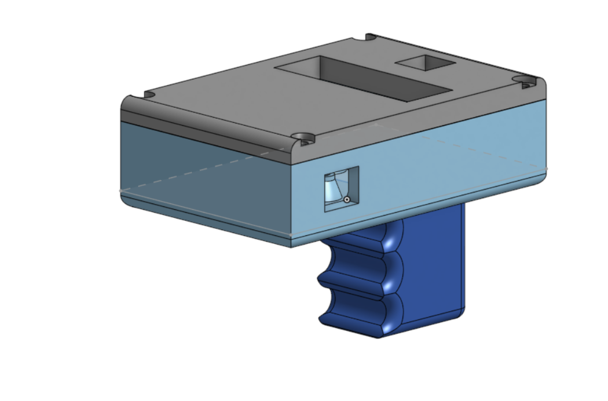
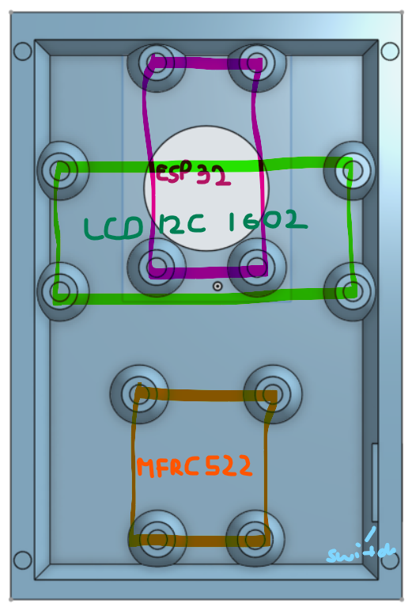

# language-learning-helper
A gadget that helps you learn everyday words in a foreign language using RFID tags.

# Features

- Total cost is about $75 USD
- It uses an ESP-32 as a microcontroller
- For reading/writing on RFID tags it uses the MFRC-522
- It projects text on an LDC I2C 1602 to conserve on pins
- The 3.7V LiPo has 450 mAh of capacity

# How it works/how to make it

The llh(language-learning-helper) uses the MFRC-522 to write an English and, in this example, a German word, on a RFID sticker. Then, after recording for example the word "door", you can stick the sticker on a door, and scan it with the llh. First the English word appears, and after you click the button(you have 20 seconds, if not, the word is revealed anyway), to reveal the German word. After a few seconds the llh can be used to scan again. 

In order to write on the stickers, you need to, after wiring the MFRC-522 up to the ESP-32, install the llhwrite code, and the following libraries:

- LiquidCrystal_I2C by Martin Kubovčík
- MFRC522 by GithubCommunity

Then you can configure the words that are to be written in the top of the code.

To use the llh you should install the llhread code.

# How to wire up the case:

First you need to wire up all the components. Using number 10 screws, you should screw down the MFRC-522, ESP32 and the LCD I2C in the positions shown in the schematic above. The LCD is not overlapping with the ESP32, and it is raised above it. The pushbutton and the rocker switch should be glued to the case with glue. The LiPo should be connected with the 5V Step-up. (OUT+ to VIN, OUT- to GND). The handle should be glued to the bottom by putting the round insert on the hole at the bottom. Lastly the case should be closed again with number 10 screws.

